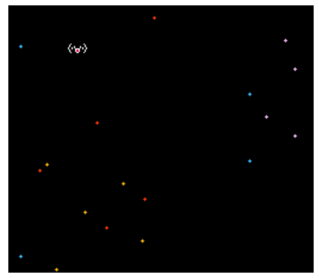

# what's this?

this is a trial JavaScript Nes emulator repository.

it's inspired by [bokuweb's flownes](https://github.com/bokuweb/flownes).

# how to play

1. yarn install
2. npm start
3. open http://localhost:3000

# image

working now!

